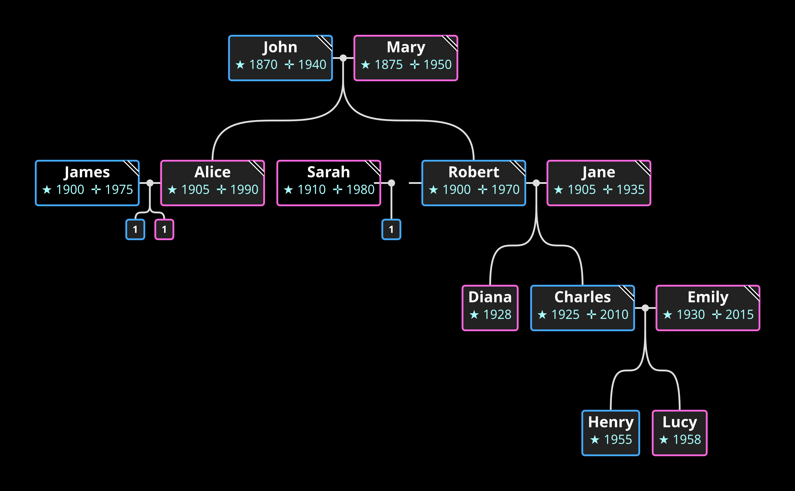
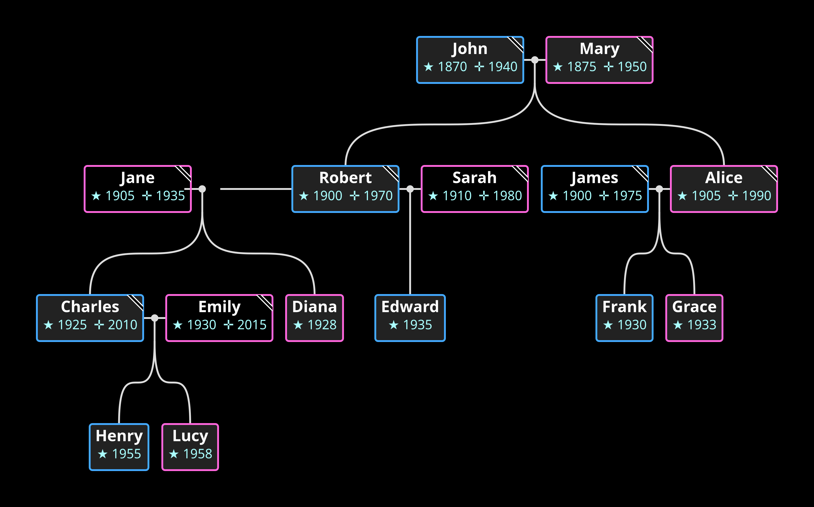

# GedcomGraph

GEDCOM family tree graph layout engine. TypeScript port of [michelesalvador](https://github.com/michelesalvador)'s original Java code. Parses GEDCOM 5.5.1, walks ancestors/descendants from any person, and produces a positioned graph. Ships with a PNG renderer and a Vite web viewer.

 

## Usage

```bash
bun install
```

**CLI renderer:**

```bash
bun run render -- demo.ged tree.png [scale] [personId]
```

**Web app:**

```bash
bun dev
bun run build
```

**Tests:**

```bash
bun test
bun run typecheck
```

## Library

```ts
const graph = new Graph()
graph.setGedcom(gedcom).maxAncestors(4).maxDescendants(4)
graph.startFrom(fulcrum)
// measure node sizes with a canvas context
graph.initNodes()
graph.placeNodes()
```

## Project layout

```
src/graph/gedcom/
  config/     Enums, constants, utilities
  core/       Metric, Node, Line base classes
  model/      GEDCOM interfaces (Person, Family, etc.)
  nodes/      PersonNode, FamilyNode, Bond
  lines/      6 line types for connections
  layout/     Group, Union, Genus layout primitives
  engine/     Graph facade, TreeWalker, Animator
render/       PNG renderer (colors, scale, draw)
web/          Vite + Panzoom browser viewer
```

Two runtime deps: `canvas` (PNG output) and `@panzoom/panzoom` (web). GEDCOM parser is vendored.

## Pipeline

```
GEDCOM → Parser → Graph.startFrom(fulcrum)
  → [measure] → initNodes() → placeNodes() → render
```

## Credits

Original Java implementation by [michelesalvador](https://github.com/michelesalvador) — see [GedcomGraph](https://github.com/michelesalvador/GedcomGraph), [GedcomGraph-Canvas](https://github.com/michelesalvador/GedcomGraph-Canvas), and [FamilyGem](https://github.com/michelesalvador/FamilyGem). This is a 1:1 TypeScript port.

## License

ISC
